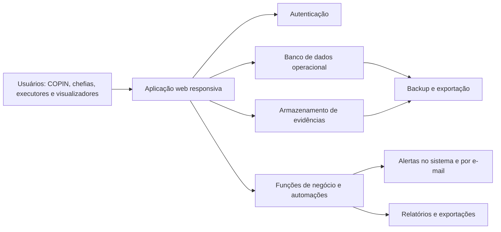

# Arquitetura Técnica do Piloto — GEPEI

**Versão:** 0.1  
**Data:** 28 de julho de 2026  
**Escopo:** piloto web da Plataforma de Gestão Integrada da Estratégia

## 1. Objetivo

Disponibilizar o piloto web responsivo do GEPEI para a COPIN e os setores selecionados, utilizando código Python e infraestrutura Google inicialmente, com preparação para futura migração à infraestrutura do Estado.

## 2. Arquitetura proposta

## 3. Componentes do piloto

| Camada | Proposta | Responsabilidade |
|---|---|---|
| Aplicação | Django em Python, com páginas responsivas e interações pontuais. | Painéis, formulários, filtros, atualização de ações e relatórios. |
| Hospedagem | Cloud Run, vinculado ao projeto Firebase/Google Cloud. | Execução da aplicação Python. |
| Autenticação | Autenticação do Django por e-mail e senha; login Google pode ser evolução. | Contas, sessão, recuperação de senha e bloqueio de usuários. |
| Dados | PostgreSQL gerenciado no Cloud SQL. | Planos, ações, atividades, riscos, relatórios, auditoria e permissões. |
| Arquivos | Cloud Storage do projeto Google Cloud. | PDFs, imagens e demais evidências. |
| Regras de negócio | Serviços Django + Cloud Run Jobs/Cloud Scheduler. | Alertas, cálculo de atraso, consolidação, auditoria e geração de arquivos. |
| Notificações | Serviço Python + remetente de e-mail a definir. | Avisos de prazo, riscos críticos, devoluções e fechamento de relatório. |
| Backup | Exportação periódica de dados e arquivos. | Recuperação, auditoria e futura migração. |

## 4. Decisões técnicas já assumidas

- A aplicação será web e responsiva para computador e celular.
- O piloto terá menos de 30 usuários.
- O acesso será por conta e senha, criada ou habilitada por administrador.
- Dados financeiros serão inseridos manualmente no MVP.
- O fluxo documental formal continua no SEI; a plataforma guarda evidências e referências a processos.
- A infraestrutura inicial utilizará o projeto Firebase/Google Cloud existente, com aplicação Python em Django, Cloud Run, PostgreSQL no Cloud SQL e arquivos no Cloud Storage.
- O projeto Firebase do piloto será criado inicialmente na conta pessoal do idealizador. Outras pessoas poderão ser adicionadas ao mesmo projeto com permissões próprias, sem compartilhamento de senha; a titularidade poderá ser transferida ou ampliada quando houver conta institucional.
- Participantes poderão acessar com endereços Gmail.
- Não há, até o momento, restrição institucional identificada para uso temporário de Firebase/Google no piloto.
- O SRH será o primeiro setor a validar o fluxo completo, além da COPIN. FUNSEP poderá ser o segundo setor-piloto.
- O limite inicial de anexos será de 10 MB por arquivo, aceitando PDF, JPG e PNG; o limite permanecerá configurável.

## 5. Estrutura de segurança

### Acesso por escopo

As permissões serão verificadas por perfil e por unidade organizacional:

- **Administrador:** configura usuários, unidades, planos e permissões.
- **COPIN:** consulta e atua em todos os registros necessários ao monitoramento e à consolidação.
- **Chefia:** gerencia ações e relatórios de sua unidade.
- **Pessoa executora:** atualiza apenas atividades que lhe foram atribuídas e inclui evidências, riscos e impedimentos.
- **Visualizador:** consulta somente os dados liberados para seu escopo.

### Controles obrigatórios

- regras de acesso no banco de dados e no armazenamento de arquivos;
- registro de alterações relevantes, com autor, data/hora e justificativa;
- preservação de histórico por até cinco anos;
- segregação de organizações e unidades no modelo de dados;
- validação de tipo e tamanho de anexos;
- backup periódico e teste de restauração;
- uso de dados reais somente após validação de permissões, proteção de dados pessoais e regras de operação do piloto.

## 6. Fluxos automatizados prioritários

1. Marcar ação ou atividade como atrasada quando ultrapassar o prazo.
2. Alertar responsável, chefia e COPIN sobre prazos próximos, pendências de atualização e devoluções de relatório.
3. Alertar a COPIN sobre risco alto, muito alto ou materializado.
4. Calcular percentual de ação a partir de atividades ponderadas.
5. Registrar trilha de auditoria em alterações críticas.
6. Reunir automaticamente dados para o relatório setorial.
7. Bloquear alterações comuns após o fechamento de um ciclo de relatório.
8. Gerar exportações de relatórios em PDF, Excel e Word.

## 7. Estratégia de dados e migração

### Carga inicial

1. Preparar estrutura organizacional e contas do piloto.
2. Importar o PEI a partir dos artefatos originais.
3. Revisar e publicar a estrutura pela COPIN.
4. Cadastrar ações estratégicas, responsáveis e atividades iniciais.
5. Realizar teste controlado com COPIN e um setor-piloto.

### Migração futura

Para evitar dependência excessiva do ambiente inicial, deverão existir exportações estruturadas de:

- dados do banco em formatos abertos;
- arquivos e metadados de evidências;
- usuários, perfis e unidades;
- registros de auditoria;
- configurações de planos e relatórios.

## 8. Ambientes

| Ambiente | Uso | Dados permitidos |
|---|---|---|
| Desenvolvimento | Construção e testes técnicos. | Dados fictícios ou anonimizados. |
| Homologação | Validação da COPIN e dos setores-piloto. | Dados de teste; dados reais somente quando autorizados. |
| Produção-piloto | Operação controlada. | Dados institucionais autorizados e estritamente necessários. |

## 9. Fora do escopo técnico do MVP

- integração automática com sistema financeiro estadual;
- integração automática com o SEI;
- aplicativo móvel nativo;
- estrutura completa de PESP e PPA;
- motor completo de vínculos entre planos;
- inteligência artificial preditiva.

## 10. Decisões necessárias antes de iniciar a implementação

1. Definir, durante a implementação, o endereço remetente e o serviço de envio dos alertas. Até essa configuração, a plataforma poderá apresentar alertas internos normalmente.

## 11. Próxima entrega técnica

Após validação das decisões acima, o próximo documento será a especificação de telas e fluxos do MVP, usada para iniciar a implementação do protótipo funcional.
