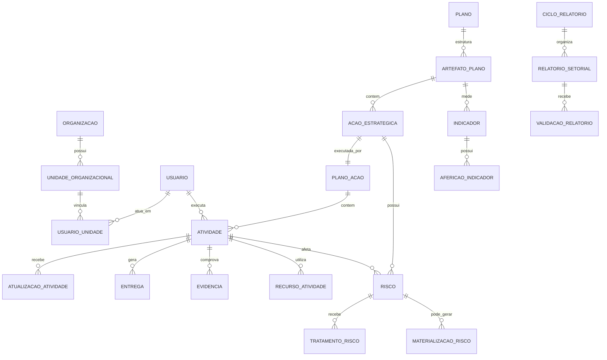

# Modelo Lógico de Dados — MVP

**Versão:** 0.1  
**Data:** 28 de julho de 2026  
**Referências:** `DOCUMENTO_DE_VISAO_E_ESCOPO_MVP.md` e `BACKLOG_MVP.md`

## 1. Princípios de modelagem

- Uma **Ação Estratégica** é estável e somente muda por revisão formal do plano.
- A execução ocorre por meio de um **Plano de Ação Operacional**, formado por atividades atribuídas a pessoas executoras.
- Um mesmo elemento pode se relacionar com diferentes planos, mas a integração completa entre instrumentos é evolução P1.
- Atualizações, evidências, alterações e validações precisam ser rastreáveis.
- O ciclo de relatório consolida registros já lançados durante a execução; não deve ser o único momento de registrar problemas ou riscos.

## 2. Visão das entidades

## 3. Organização, pessoas e permissões

### Organização

| Entidade | Finalidade | Campos essenciais |
|---|---|---|
| `organizacao` | Raiz institucional ou órgão participante. | nome, sigla, tipo, ativo. |
| `unidade_organizacional` | Representa órgão, unidade ou setor. | organização, unidade_pai, nome, sigla, tipo, ativo. |
| `usuario` | Pessoa com acesso ao sistema. | nome, e-mail, ativo, data_ultimo_acesso. |
| `usuario_unidade` | Vínculo de uma pessoa com uma unidade. | usuário, unidade, função, data_início, data_fim. |
| `perfil_acesso` | Perfil de permissão. | nome: administrador, COPIN, chefia, responsável, visualizador. |
| `usuario_perfil` | Atribuição de perfil por escopo. | usuário, perfil, organização/unidade, vigência. |

## 4. Planos e artefatos estratégicos

### Estrutura flexível

| Entidade | Finalidade | Campos essenciais |
|---|---|---|
| `plano` | Instrumento de planejamento, como PEI, PESP ou PPA. | nome, sigla, tipo, vigência_início, vigência_fim, status, versão_atual. |
| `versao_plano` | Preserva revisões formais do plano. | plano, número_versão, vigência, motivo, publicado_em. |
| `tipo_artefato` | Define tipos de nós da estrutura do plano. | nome, plano_tipo, ordem, permite_filhos. |
| `artefato_plano` | Nó genérico da estrutura do plano. | versão_plano, tipo_artefato, artefato_pai, código, nome, descrição, status. |
| `meta` | Resultado quantitativo ou qualitativo esperado. | artefato, descrição, valor_alvo, unidade, período, status. |
| `indicador` | Medida associada a meta ou objetivo. | nome, fórmula, unidade, fonte, periodicidade, linha_base, responsável. |
| `indicador_artefato` | Relação entre indicador e objetivo/meta. | indicador, artefato, papel. |
| `afericao_indicador` | Valor de indicador em um período. | indicador, período, valor, fonte, responsável, evidência, observação. |

No PEI, `artefato_plano` permite representar Dimensão BSC, Eixo Estratégico, Objetivo Estratégico e Projeto Estratégico sem criar tabelas específicas para cada nível.

## 5. Ação Estratégica e plano de ação operacional

| Entidade | Finalidade | Campos essenciais |
|---|---|---|
| `acao_estrategica` | Ação estável vinculada a um projeto, objetivo ou outro artefato. | artefato_plano, código, título, descrição, prazo, status, percentual, unidade_coordenadora. |
| `acao_unidade_participante` | Setores/órgãos que participam de uma ação. | ação, unidade, papel, observação. |
| `plano_acao` | Plano de execução operacional de uma ação estratégica. | ação, responsável_gestão, status, data_início, data_fim. |
| `atividade` | Unidade de trabalho executável e atribuível a uma pessoa. | plano_ação, título, descrição, pessoa_executora, prazo, peso, status, percentual, entrega_esperada. |
| `atividade_dependencia` | Dependência entre atividades. | atividade_predecessora, atividade_sucessora, tipo, observação. |
| `atualizacao_atividade` | Registro contínuo de execução, dificuldade ou mudança de situação. | atividade, data, autor, percentual, status, comentário, previsão_conclusão. |

### Regras

- Os pesos de atividades de um mesmo plano de ação devem totalizar 100%.
- A ação pode ter percentual calculado pelas atividades ponderadas; ajustes manuais exigem justificativa.
- Atraso é calculado automaticamente ao ultrapassar o prazo.
- Atividade concluída só é reaberta mediante justificativa, com trilha de auditoria.
- A chefia ou pessoa responsável pela gestão da ação atribui atividades a pessoas executoras.

## 6. Entregas, evidências e recursos

| Entidade | Finalidade | Campos essenciais |
|---|---|---|
| `entrega` | Entrega ou produto previsto/realizado pela atividade. | atividade, tipo, descrição, situação, data_prevista, data_realizada. |
| `evidencia` | Arquivo, imagem, link ou referência SEI que comprova execução. | entidade_origem, tipo, nome, link/arquivo, descrição, data, autor. |
| `recurso_atividade` | Recurso necessário ou utilizado pela atividade. | atividade, tipo: financeiro/logístico/pessoal, descrição, quantidade, unidade, observação. |
| `execucao_financeira` | Valores financeiros associados a ação ou atividade. | recurso, previsto, empenhado, liquidado, pago, fonte_recurso, programa_orçamentário, ação_orçamentária, período. |

## 7. Mapa de riscos

| Entidade | Finalidade | Campos essenciais |
|---|---|---|
| `risco` | Registro principal do risco no plano de ação. | ação/atividade/projeto afetado, título, descrição, categoria, causa, responsável, situação. |
| `avaliacao_risco` | Análise de probabilidade, impacto e nível. | risco, data, probabilidade, impacto, nível, tipo: inerente/residual, autor. |
| `tratamento_risco` | Decisão e medidas para resposta ao risco. | risco, decisão: aceitar/mitigar/evitar/transferir, justificativa, responsável, prazo, medida_preventiva, contingência. |
| `materializacao_risco` | Registro do evento ocorrido. | risco, data, descrição, impacto_ocorrido, providências, evidências. |
| `aceite_risco` | Aceitação formal conforme alçada. | risco, nível, autoridade, decisão, justificativa, data. |

### Regras

- Matriz de risco: 5 x 5 de probabilidade e impacto, com nomenclatura configurável.
- Avaliações de risco inerente e residual são opcionais.
- Riscos altos, muito altos ou materializados disparam alertas à COPIN.
- Causas são inicialmente texto livre com sugestão de termos já utilizados; catálogo reutilizável é evolução futura.
- Campos de tratamento e materialização são condicionais: só são exigidos quando a situação ou decisão os tornar necessários.

## 8. Relatórios e validação

| Entidade | Finalidade | Campos essenciais |
|---|---|---|
| `ciclo_relatorio` | Período configurado para prestação de contas. | plano, tipo: trimestral/quadrimestral/semestral/anual, início, fim, data_limite, status. |
| `relatorio_setorial` | Relatório de uma unidade em um ciclo. | ciclo, unidade, responsável_preparação, status, enviado_em, fechado_em, síntese. |
| `relatorio_item` | Fotografia de ação, atividade, risco ou indicador no relatório. | relatório, entidade_origem, situação, texto_consolidado. |
| `validacao_relatorio` | Envio, validação ou devolução para correção. | relatório, validador, decisão, comentário, data, novo_prazo. |
| `relatorio_consolidado` | Consolidação institucional da COPIN. | ciclo, responsável, status, documento_exportado, enviado_em. |

### Regras

- Registros lançados durante a execução são reunidos automaticamente no relatório.
- O período fechado preserva uma fotografia dos dados e bloqueia alterações comuns.
- Se a chefia for executora de atividade no relatório, a plataforma exige validador alternativo, como gestor superior ou COPIN.
- A validação registra autor, data/hora, decisão e comentário.

## 9. Auditoria e notificações

| Entidade | Finalidade | Campos essenciais |
|---|---|---|
| `historico_alteracao` | Trilha de auditoria de dados relevantes. | entidade, identificador, campo, valor_anterior, valor_novo, autor, data, justificativa. |
| `notificacao` | Alerta no sistema e por e-mail. | destinatário, tipo, mensagem, entidade_origem, emitida_em, lida_em. |

O histórico de acessos e alterações deverá ser preservado por até cinco anos.

## 10. Integração entre planos — evolução P1

| Entidade | Finalidade | Campos essenciais |
|---|---|---|
| `vinculo_artefato` | Relação entre elementos de planos diferentes. | origem, destino, tipo_vínculo, natureza: direta/indireta, peso_percentual, vigência, observação. |

Tipos iniciais: contribui para, financia, mede, executa, depende de, está alinhado a e é evidência de.

## 11. Decisões pendentes para a arquitetura física

1. Definir os cinco rótulos e faixas da matriz de risco 5 x 5.
2. Definir se a relação de causa será catálogo estruturado após o MVP.
3. Detalhar o modelo de projeto transversal e suas frentes de trabalho.
4. Definir limites de tamanho, retenção e política de anexos.
5. Especificar as regras numéricas de semáforo por indicador, meta e orçamento.
